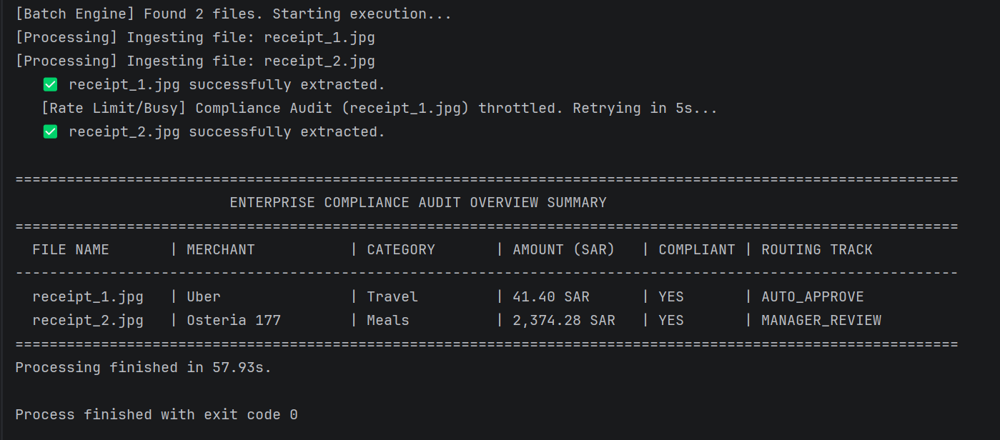
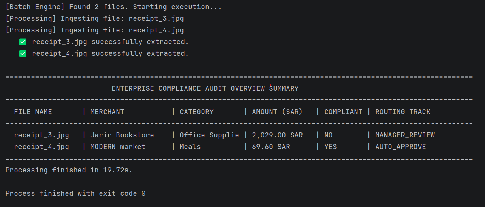

# Autonomous Expense Auditor

An automated pipeline for processing, extracting, and auditing employee expense receipts against corporate policy. Built with Google Gemini's vision capabilities and structured output enforcement via Pydantic schemas.

---

## Overview

This tool ingests receipt images, extracts structured data using a multimodal LLM, converts amounts to SAR using live exchange rates, and routes each expense through a compliance engine. All of this is done concurrently, with built-in resilience against API rate limits.

---

## Features

- **Multimodal Extraction** : Reads receipt images and returns structured, schema-validated data using Gemini 2.5 Flash
- **Multi-currency Support** : Fetches live exchange rates and normalizes all amounts to SAR
- **Policy-based Routing** : Classifies each expense as `AUTO_APPROVE`, `MANAGER_REVIEW`, or `HUMAN_AUDIT_QUEUE` based on a configurable policy file
- **Confidence Flagging** : Low-confidence extractions (< 0.85) are flagged in the audit payload
- **Resilient Execution** : Exponential backoff retry logic handles 429/503 API errors automatically
- **Concurrent Batch Processing** : All receipts are processed in parallel via `asyncio.gather`
- **Structured Terminal Report** : Results are rendered as a formatted compliance summary table

---

## Project Structure

```
project/
│
├── main.py            # Core pipeline
├── policy.txt         # Corporate expense policy (loaded at runtime)
├── .env               # Environment variables (API keys)
│
└── receipts/          # Drop receipt images here (.jpg / .jpeg)
```

---

## Setup

### 1. Install dependencies

```bash
pip install openai pydantic httpx python-dotenv
```

### 2. Configure environment variables

Create a `.env` file in the project root:

```env
GEMINI_API_KEY=your_gemini_api_key_here
```

### 3. Define your corporate policy

Create a `policy.txt` file in the project root. Example:

```
Company Expense Policy:
1. All standard travel expenses are permitted.
2. Any single travel or meal expense exceeding 150 SAR requires manager review.
```

If `policy.txt` is not found, the pipeline will fall back to a default policy and log a warning.

### 4. Add receipt images

Place all receipt images (`.jpg` or `.jpeg`) inside a `receipts/` folder in the project root. The folder will be created automatically on first run if it does not exist.

---

## Usage

```bash
python main.py
```

### Output Example






---

## Pipeline Stages

| Stage | Description |
|---|---|
| **1. Extraction** | Gemini reads the receipt image and returns structured `ReceiptData` |
| **2. Normalization** | Total amount is converted to SAR via live exchange rate API |
| **3. Compliance Routing** | Gemini evaluates the payload against `policy.txt` and assigns a routing destination |

---

## Notes

- Only `.jpg` and `.jpeg` files are supported as input
- All amounts in the report are denominated in SAR regardless of the original receipt currency
- Receipts that fail all retry attempts appear as `ERROR: Quota Exhausted` in the output table
- The pipeline uses `asyncio.gather(..., return_exceptions=True)` so a single failing receipt does not halt the batch
